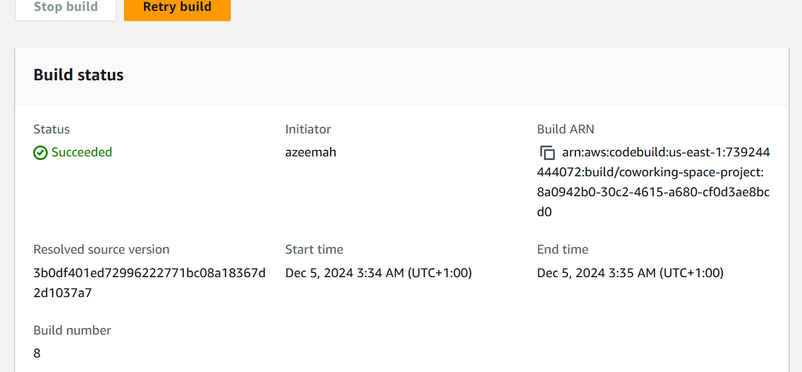
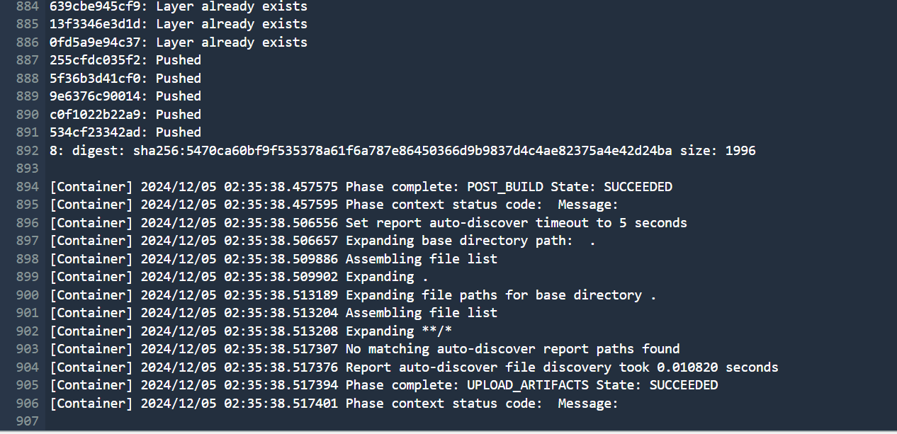
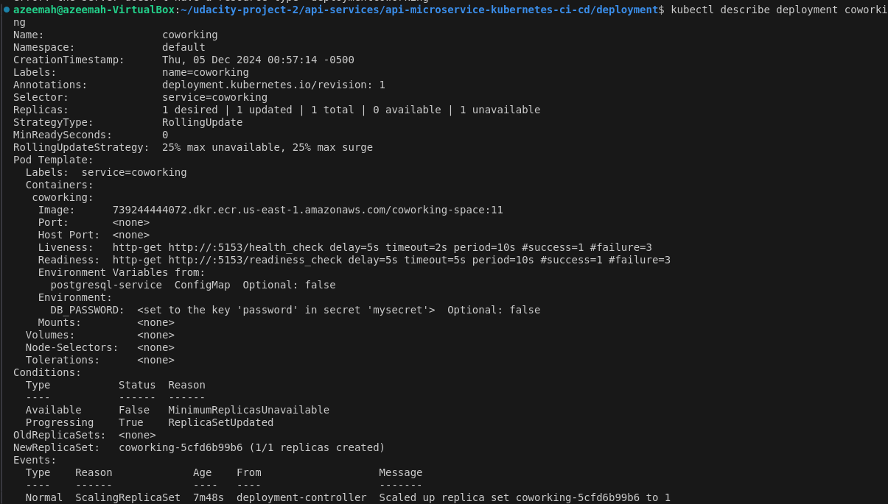

# Project Name: Coworking Space Microservice

## Overview

This project deploys a Coworking Space microservice using Kubernetes, Docker, and AWS. The service is designed to manage coworking space operations, using PostgreSQL for data storage and Flask for the web API. The deployment process is automated using AWS CodeBuild to build and push images to ECR, monitoring with CloudWatch.

### Dependencies
#### Local Environment
1. Python Environment 
2. Docker CLI 
3. Kubectl

#### Remote Resources
1. AWS CodeBuild - build Docker images remotely
2. AWS ECR - host Docker images
3. Kubernetes Environment with AWS EKS - run applications in k8s
4. AWS CloudWatch - monitor activity and logs in EKS

### Setup
#### 1. Create EKS cluster and update the kubeconfig

### 2. Create a postgres database

### 3. Running the Analytics Application Locally
In the `analytics/` directory:

1. Install dependencies

2. Run and verify the application 

### 4. Create a buildProject in CodeBuild console and set variables

### 5. Create a private repository in ECR for docker images

1. create your `buildspec.yaml` in the root folder: to automate docker build and push it to the ECR

- start build

- Images in ECR

### Deploy application

1. create `configmap.yaml` and `coworking.yaml` in the deployment/

- kubectl get svc

- kubectl get pods

- kubectl describe svc <DATABASE_SERVICE_NAME>

- kubectl describe deployment <SERVICE_NAME>

- AWS CloudWatch Container Insights logs for the applications

